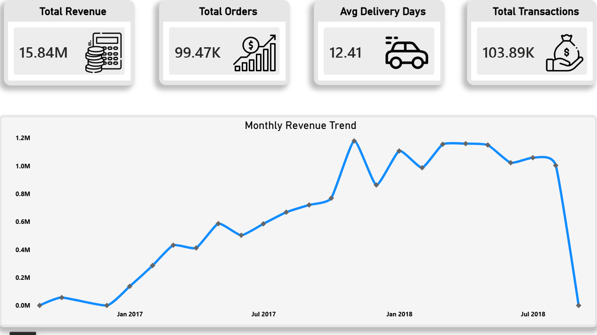
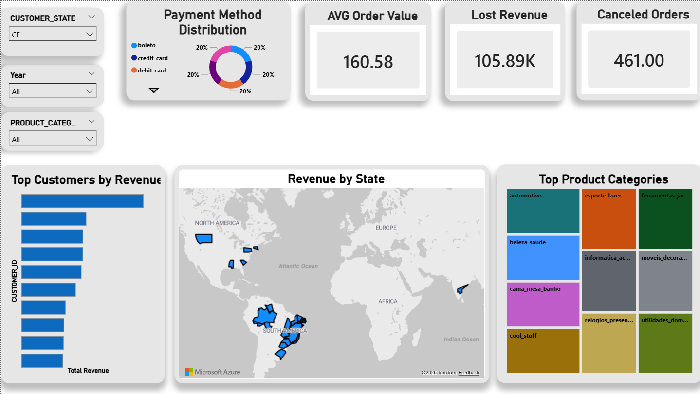
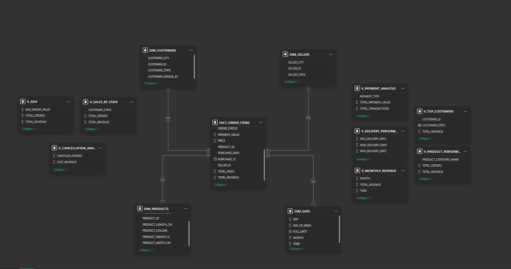

# 🛒 E-Commerce Data Warehouse Project

End-to-end E-Commerce Data Warehouse project built using Snowflake, SQL, and Power BI.

---

# 📌 Project Overview

This project simulates a real-world modern data warehouse solution for an E-Commerce business.

The project covers:

- Data Warehousing
- ETL Pipeline Design
- Data Modeling
- KPI Development
- Interactive Dashboards
- Business Insights

---

# 🏗️ Architecture

RAW Layer → STAGING Layer → ANALYTICS Layer → Power BI Dashboard

---

# 🧱 Data Warehouse Layers

## RAW Layer
Stores raw source data ingested from the E-Commerce dataset.

## STAGING Layer
Performs:
- Data cleaning
- Standardization
- Type casting
- Feature engineering
- Delivery calculations

## ANALYTICS Layer
Implements:
- Fact table
- Dimension tables
- Star schema model
- KPI Views for business reporting

---

# 🛠️ Technologies Used

- Data Modeling
- ETL Pipelines
- Star Schema Design
- Snowflake
- SQL
- Power BI
- GitHub

---

# 📊 KPI Views & Business Metrics

The analytics layer was designed using SQL Views to simplify business reporting and dashboard creation.

Created KPI Views include:

- Monthly Revenue Trend
- Top Customers by Revenue
- Product Performance Analysis
- Payment Method Analysis
- Delivery Performance Analysis
- Sales by State
- Average Order Value (AOV)
- Cancellation & Lost Revenue Analysis

---

# 📈 Dashboard Features

## Executive Dashboard
- Revenue Trend Analysis
- KPI Cards
- Monthly Revenue Trend

## Business Insights Dashboard
- Top Customers by Revenue
- Revenue by State
- Product Category Analysis
- Payment Method Distribution
- Interactive Filters

---

# 🧩 Data Model

Star Schema Design:

- FACT_ORDER_ITEMS
- DIM_CUSTOMERS
- DIM_PRODUCTS
- DIM_SELLERS
- DIM_DATE

---

# 📸 Dashboard Preview

## Executive Dashboard

## Business Insights Dashboard

## Data Model

---

# 💡 Business Insights

Key findings from the dashboard:

- Revenue showed strong growth during 2017–2018
- Credit cards are the dominant payment method
- Some product categories generate significantly higher revenue
- Cancelled orders contribute to revenue loss
- Customer revenue distribution highlights high-value customers

# 🚀 Author

Kareem Abdelrhman
